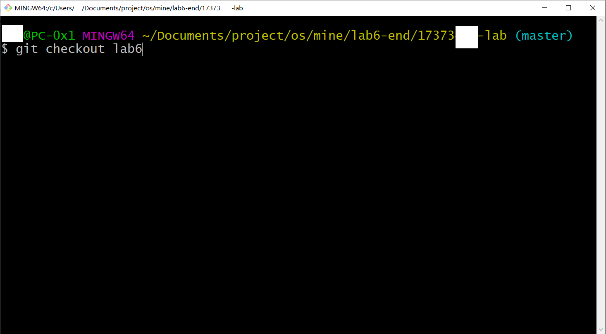
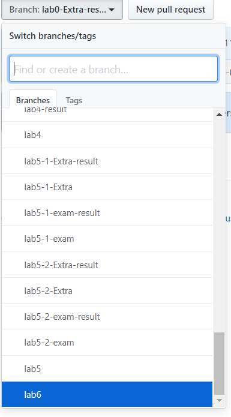

# 北航 6系 操作系统（课程设计）课 实验代码
## 说明
这里是我直接从实验环境中下来的代码。由于课上的时间原因，会有各种有着奇怪的提交massage的杂乱的提交记录，请无视。

北航的OS实验课是一门不错的课，希望这份代码可以仅作为一个参考，帮助大家更好的完成OS，少踩一些坑。也希望不要抄袭，仔细思考还是比较有趣的。

由于经常出现做到后面发现前面的lab的bug的情况，因此建议尽量参看我lab6的代码。（前面的代码可能有不小心写下的bug，lab6的时候我尽量把能找到的bug都改了）

其中，我有几次Extra没有得到满分，参考这些Extra的代码的时候，需要注意。（可以checkout到-result结尾的分支看成绩。

## 使用方法
这个README在MASTER分支，请自行使用形如`git checkout lab6`这样的语句切换到对应分支查看代码。

或者，直接在github上下载lab6分支的代码。

